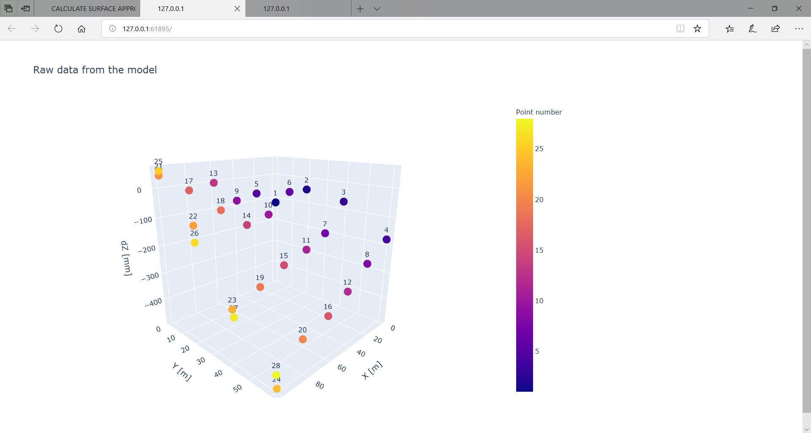
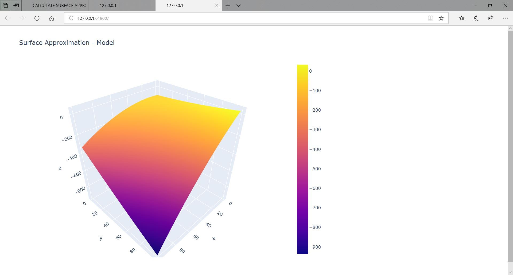

# Surface_Approximation

## ABOUT
Google Colab project which allows users to enter a specified data model and make surface approximation
based on entered points data. It generates "raw data" and "result" plots.

SurfApp.zip contains a project of the website created for Surface Approximation management.

## MAIN REQUIREMENTS
* points file format (*.txt; [point number, x, y, dz] -> 1	0.5	0.5	-119.3) -> Model.txt
* entered model format: "a[0] + a[1]x + a[2]y", "a[0] + a[1]x + a[2]y + a[3]x^2 + a[4]y^2 + a[5]xy"... -> Model_templates.txt

## METHOD OF WORKING
Google Colab
* input the Google Colab file with your points 
* change variable "path" to the name of your points file if the name is different than "Model.txt"
* change tested model on your new one (change variable "model_shape2")
* run script

Website

